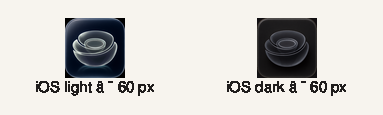
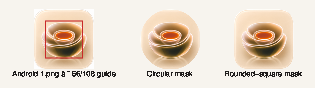

# Mise brand review board

This board records the code-level baseline for the brand change. It does not
replace simulator and physical-device captures in the owner acceptance pass.

## Repository inventory

| Area | Current authority | Audit result |
| --- | --- | --- |
| App icons | `assets/brand/icon-concepts/` | Seven original 1254 px PNGs, catalogued by stable descriptive name. |
| Expo configuration | `app.config.ts` | iOS light/dark and Android regular/adaptive paths use the selected PNGs; iOS tinted is omitted. |
| Tokens | `src/constants/theme.ts`, `src/constants/themePalettes.ts` | Three palettes resolve through one shared set of colour roles; all other visual tokens remain centralized. |
| Shared UI | `src/components/` | Text, screen, card, field, button, sheet, toast, empty, macro, and processing roles have shared implementations. |
| Primary screens | `app/` | Today, Pantry, capture/review, recipes, onboarding, and Settings consume the shared theme and components. |
| Exploration | `docs/brand-explorations/organic-redesign/` | Visual and copy reference only; current behavior remains authoritative. |

## Baseline surfaces

| Surface | Current baseline | Brand acceptance focus |
| --- | --- | --- |
| Today with meals | Putty ground, white cards, Fraunces calorie figure, Archivo controls, paprika/wheat/olive macro data. | Data hierarchy, save feedback, day rail, and readable uncertainty. |
| Empty Pantry | Shared empty state, static half-empty-shelf illustration, and direct add/capture actions. | Keep the illustration subordinate to the specific next action and verify owner visual acceptance. |
| Capture and review | Native camera controls, faithful evidence image, ink scrim, explicit status/recovery. | Shared macro-dot analysis state; never wash or recolour evidence. |
| Saved recipe | Shared ground, cards, type roles, and semantic food data. | Preserve recipe information and actions while changing only shared visual roles. |
| Settings | Shared rows, sheets, fields, and factual provider/privacy copy. | Narrow-width labels, keyboard safety, and accurate local/provider boundary. |

## Direction decision

The responsive three-way review is available at
[`docs/brand-explorations/cool-organic-comparison.html`](./brand-explorations/cool-organic-comparison.html).
It compares identical Today content across Utility, the reduced-warmth Organic
default, and Cool Organic. On narrow screens the phone frames use horizontal
scroll snapping.

| Theme | Status | Character |
| --- | --- | --- |
| Organic | Default | Cream and sand with less yellow warmth; terracotta action and restrained olive. |
| Utility | Selectable | Existing putty, white, and near-black production palette. |
| Cool Organic | Selectable | Neutral stone, near-white surface, and juniper action. |

The owner approved the three-theme model. All themes use Fraunces/Archivo and
the same semantic roles, geometry, hierarchy, behavior, and data contracts.

## Launcher-size evidence

Both iOS variants retain the bowl silhouette and central vessel at 60 px. The
lighter-dark version separates more clearly on a light launcher; the pure-dark
version remains legible for dark appearance.

The Android source remains readable under circular and rounded-square masks,
but the outer bowl silhouette extends outside the strict 66/108 foreground
safe-zone guide. It is accepted as the regular icon and configured as the
adaptive foreground. A 2026-08-11 Pixel 10a Android 37.1 release-APK check
confirmed that the circular and rounded-square launcher masks do not visibly
crop the bowl and that Android App Info remains recognisable. The
legacy monochrome override failed the same device's Minimal icon style by
rendering an unrelated chevron-like glyph, so it was removed. No alternative
PNG is silently substituted; the rebuilt full-colour fallback remains
recognisable in Minimal mode until an approved Mise monochrome export exists.
Share-sheet and notification icon checks were unavailable because Mise is not a
share target and had no active notification surface in this build.

## Baseline comparison outcome

The implementation keeps the original task and evidence hierarchy while moving
the named surfaces onto one theme-aware component system. Organic is less
yellow than the ZIP candidate without changing its terracotta, wheat, and olive
family; Utility preserves the earlier production option; Cool Organic remains
an explicitly selectable cooler alternative. Today is not expanded with dense
analytics, camera and receipt evidence is not recoloured, and empty Pantry gains
only its named static shelf state. The Android launcher preserves the selected
glass-bowl artwork rather than substituting an attractive but unrecognisable
system-tinted glyph.

## Remaining capture set

Final acceptance still needs owner-device screenshots of the five baseline
surfaces, an additional Android/OEM mask pass, and iOS light/dark launcher and
Settings appearances. Record those observations in
`docs/owner-app-test-checklist.md` before archive.
