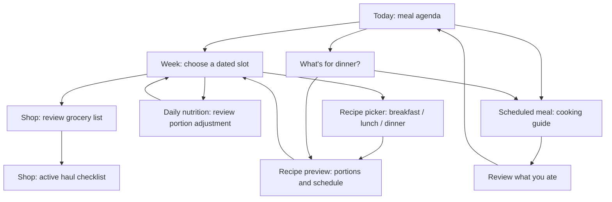

## Context

See proposal.md for the requested product shift. Live inspection found four tabs, a dinner CTA in Today, an ephemeral `MealPrepPlan` in onboarding, and a source-aware shopping list. `MealPrepPlan` describes one recipe's preparation, not a dated schedule. Its templates lack a complete per-serving nutrition contract. `mealFromRecipe` currently builds a suggestion with zero calories, so it cannot be treated as verified planner nutrition. Shopping refresh currently treats canonical presence as coverage and retains the first supplied quantity rather than summing repeated cooking demand.

The existing `guide-into-first-prep-plan` proposal has no completed tasks and explicitly excludes full meal planning. Reuse its motivating persistence defect, not its proposed parallel storage model. The screenshot is transcribed in the proposal; its temporary image path is not a runtime or documentation dependency.

## Goals / Non-Goals

**Goals:** One durable schedule, one recipe snapshot for nutrition and shopping, and one review/logging boundary. A first useful schedule must work locally before any optional capture/provider operation.

**Non-Goals:** A new nutrition-target engine, auto-generated ingredient substitutions, a second shopping list, or a redesign of the existing depletion models. Planned nutrition never enters eaten totals.

## Decisions

These answers are planning defaults selected by the author at the user's request. They resolve implementation scope without presenting inferred preferences as research findings.

### 1. What goes at the front?

Keep Today, Pantry, Shop, Settings and the central Add action. Today opens to the selected day's breakfast/lunch/dinner agenda with a Today/Week switch; Week shows a seven-day strip and readable day sections. Start the displayed week on Monday and store explicit local dates. Selecting a date is never inferred from a UTC timestamp.

The single primary action follows state: the next scheduled meal when one is upcoming on the selected day, otherwise **Plan your week** when empty or **Continue planning** for a partial week. A finished day offers **View week**. **Review groceries** is available from the week summary and opens Shop. Actual nutrition and meal history remain clearly labelled below the schedule and through existing history controls. “What's for dinner?” remains a visible secondary action, one tap from Today and empty dinner slots. Do not require planning to log or request dinner.

Rejected: a fifth planner tab or a second dashboard layered above all existing hero cards. The goal is replacement of emphasis. Keep large-screen week columns possible, but phone interaction uses a scrollable agenda, not seven cramped columns. Long-press drag can move recipes; tap **Move to…**, **Copy to…**, **Replace**, and **Remove** provide full parity. Dropping onto an occupied slot offers explicit replace or cancel; it never overwrites silently. Back/cancel preserves the saved plan.

### 2. What is a template?

The user explicitly clarified that scheduling anticipates a grocery haul. The primary sequence is choose meals → schedule → generate the grocery list → shop → cook/log. Planner selection must not inherit the dinner engine's pantry-coverage gate, use-first constraint, or missing-ingredient limit. A recipe requiring every ingredient to be purchased is a normal planning choice. Reuse identity and dietary logic without reusing pantry-constrained eligibility. Pantry coverage is optional context after selection, not the default selection objective.

Distinguish a `PlannerRecipe` (one cookable recipe), a `MealSchedule` (dated meal slots), and a `WeekTemplate` (saved relative weekday/meal choices). Keep legacy `MealPrepPlan` compatible through an adapter, not a semantic rename across the app. Suggestion templates in `suggestionTemplates.ts` remain ranking presets and are unrelated to these records.

The local picker exposes meal type and cuisine, cooking time/equipment, portions, dietary compatibility, ingredient coverage, and estimated nutrition. Bundle a small reviewed collection with at least three distinct options per meal type, including a no-cook breakfast and meaningful Asian cuisine coverage; recipes can serve multiple meal types. Seven is not a product requirement. Exact titles remain a content task. Saved recipes are also selectable. Unknown source yield/quantities or nutrition prompt for review; users can schedule incomplete recipes with an explicit incomplete grocery/nutrition result.

Reuse existing canonical IDs, dietary checks and food visuals, but audit starter recipes before reuse: instructions can mention ingredients absent from the ingredient list, and labels are not proof of dietary eligibility. Hard exclusions apply to resolved ingredients, including sauces and optional ingredients unless explicitly omitted. Unresolved ingredients stay unverified; do not label a recipe compatible until checked. Missing pantry stock never excludes a planned recipe. Cuisine is a preference, not a dietary override.

Save immutable versioned snapshots containing source identity, title, steps, base yield, ingredient IDs/units/preparation basis, optional inclusion, nutrient values and provenance. Future source edits or deletion do not silently rewrite saved weeks. **Update from recipe** previews the change. Copying a week uses new identities and clears eaten, skipped, purchase, and pantry-review state.

### 3. How do portions fit goals?

Use existing confirmed daily targets; never change the profile because a recipe was selected. For future days compare planned totals to that day's existing target or the current profile target labelled as a projection. Today can show actual logged nutrition plus remaining unlogged plan entries as **Projected**, counting a linked logged entry once. Keep **Eaten** separate. Unplanned meals count only when logged. Partial days show coverage rather than claiming complete daily fit.

Initial **Adjust portions** operates on one selected meal. For its unlocked portion, evaluate multipliers 0.5–2.0 in 0.25 steps against the residual calorie/protein/carbohydrate/fat target after other known planned entries (or actual plus unlogged entries for Today). Choose the candidate with minimum mean normalized absolute deviation across positive, known targets, tie-breaking by smallest change then lower multiplier. These bounds are transparent product defaults, not health thresholds. Require complete energy and P/C/F data for all included entries before automatic fitting; otherwise offer manual portions and identify missing data. Targets absent or nonpositive do not yield ratios. No suitable improvement means report the gap and leave the recipe unchanged.

This scales a recipe; it cannot alter its macro ratio. Show the residual explicitly and offer another recipe when a different balance is needed. Preview calories, macros, ingredient amounts, and grocery changes together; only Apply persists. Whole-item rounding and optional ingredients require explicit recipe rules, with nutrition recomputed from actual accepted quantities. If there is no defensible conversion or rounding rule, retain the exact fractional recipe amount and explain it; never invent densities, raw/cooked conversions, or pack sizes. Missing nutrition stays unknown, never zero. Manual portion values must be positive and finite; no automatic target adjustments or promises of exact matching.

### 4. How do batch cooking and leftovers work?

Every ordinary scheduled meal initially owns a cooking batch. **Use portions from…** explicitly links later entries to that batch. Store total produced recipe-equivalent portions separately from the person's planned consumption; other diners can be represented by production quantity without accounts or separate nutrition profiles. Sum grocery ingredients once per batch, not per eating slot. Allocated portions cannot exceed production; offer to increase production or reduce allocations. A batch's cooking date must be on or before its consumption dates. Dates do not imply safe storage life.

Example arithmetic fixture, not a recipe claim: a four-portion batch requiring 600 g of an ingredient feeds four one-portion lunches. Grocery demand is 600 g, not 2,400 g; each planned lunch carries one portion's nutrition. Scaling production to six portions raises demand to 900 g and does not change a one-portion lunch's nutrition. Making someone's lunch 1.5 portions changes that slot and the capacity check, not every other meal.

Scheduling, moving, skipping, and checking groceries never log meals or consume stock. **Cook and log** enters existing editable review with planned date, batch production, and eaten portion separately visible; future dates require choosing an actual eating date. Saving the ordinary meal atomically links the slot/batch and applies existing depletion once. Later portions use the existing leftover path without further ingredient depletion. Repeated saves are idempotent. Cancel writes no meal; meal edits/deletion reconcile links using existing reversal rules. Deleting a plan never deletes historical meals. Cooking without eating can stay a plan; separate production-only inventory is out of scope.

### 5. How is Shop kept accurate?

Creating a schedule computes a grocery preview immediately. **Use this grocery list** confirms its selected date range into the existing Shop list. Later schedule edits recompute a staged diff; Shop shows **Plan changed — review groceries** until applied. Do not silently mutate purchased or manually edited entries.

The full recipe-derived list is usable with an empty, unconfigured or ignored pantry. **Check pantry** is optional: users can skip all coverage checks and apply the full list immediately. Never require pantry capture, a stock audit, or an answer for each ingredient before a grocery haul. Confirmed items already owned reduce the list only when the user chooses that refinement; absence of coverage confirmation means retain the requirement, not block the list.

Demand keys include batch ID and snapshot ingredient ID. Aggregate canonical ingredients with compatible units using existing defensible conversions; unresolved ingredients retain source identity and incompatible units remain separate quantity lines under one ingredient. Known and unknown contributions must both be displayed. Optional ingredients count only when included. Stated recipe demand is defensible; estimated pantry quantity is not proof of coverage. Default to full demand with **Check pantry** for known stock. The user can confirm a covered amount or **Have enough** against the current demand revision. Allocate confirmed coverage once across all contributing batches. Changed demand invalidates that coverage for review; never subtract the same rice bag independently for every meal.

Persist source-level demand, coverage decisions, applied revision, and completion provenance. Plan sources coexist with manual, pantry-low, recipe, and dinner sources. Do not count the same recipe occurrence twice when it was previously explicitly added: offer transfer of that identified source to the plan; unrelated requests remain separate. Reapplying identical revisions changes nothing. Removing a scheduled meal removes only its source after review, preserving other sources and closed history. Purchased/snoozed/dismissed rows are not silently reopened; increased demand appears as a new reviewable outstanding contribution. Receipts retain exact-match behavior but a partial purchase does not prove the whole weekly quantity is covered; preserve purchased history and expose residual/unknown coverage for review. Apply undo restores the prior plan contributions without reverting pantry or receipts.

### 6. What happens in onboarding and existing installs?

Keep the two starting choices. Make **Plan my meals** the leading option; **Set my calorie & macro target** remains direct. The planning path asks brief dietary/equipment preferences with skips, offers local recipes without requiring pantry capture, and saves the first recipe into a chosen date/meal. Show the week immediately; offer goal setup and pantry capture in context later. Calorie-first setup ends with plan-week or enter-app choices. Skips retain usable empty slots, dinner fallback, and Add.

Existing installations keep meals, recipes, targets, onboarding completion, and captured stock. Do not replay onboarding or invent previous plans from transient screens. Empty Today introduces planning with one dismissible cue. A persisted first plan, if another change lands before this implementation, must be explicitly imported via an adapter after inspecting its actual schema.

### 7. Persistence and implementation seams

Add forward-only migration(s) to `MIGRATIONS` in `src/db/schema.ts`; choose version numbers from live state at implementation time. Proposed entities: `meal_schedules` (week start, revision), `planner_recipe_snapshots` (versioned payload), `planned_batches` (snapshot, production, cook date, linked first meal), `planned_meal_slots` (local date, meal type, batch, portion, status, linked meal), `week_templates` with relative entries, and plan shopping contributions/coverage/apply history. Unique date/meal slots prevent drag races. Transactions enforce revision checks, slot uniqueness, batch capacity, and atomic apply/undo. A stale edit asks for reload with a preserved draft. Saving failure keeps the last committed schedule and the editable draft.

Use `src/db/queries/` modules exported via `src/db/queries/index.ts` and `src/db/queries.ts` (the current implementation supersedes the config's older single-file layout). SQL stays behind that database boundary. Use separate pure logic modules for scheduling, nutrition, and grocery projection and a `src/store/mealScheduleStore.ts` orchestration layer. Extend types in `src/types.ts`; update export/reset queries and `src/logic/export.ts` as needed.

Existing integration seams: `src/logic/mealPrepTemplates.ts`, `mealPrepMatching.ts`, `recipe.ts`, `shoppingList.ts`, `shopService.ts`, `suggestionService.ts`, `src/db/queries/{recipes,shopping,meals,profile}.ts`, `src/store/cookingPreferencesStore.ts`, `src/logic/onboarding{Domain,Guards,Stages}.ts`, `app/(tabs)/{index,shop,pantry,_layout}.tsx`, onboarding starting-point/first-plan routes, `app/dinner.tsx`, recipe detail and meal review routes. Inspect exact review/store save transactions before extending them. New planner picker/editor components reuse theme tokens and `FoodVisual`/`DishVisual`; no new image generation dependency.

## Mobile UI brief

### Job, evidence and visual authority

**Mode: Operate.** Design for a person choosing a week's meals on the sofa, checking groceries in a shop, and opening a cooking guide with one hand. Success is a saved dated meal and a usable grocery list before any pantry setup; the recurring success is returning to that meal without reconstructing choices.

Extend Mise's current illustrated food identity and semantic theme system. `DESIGN.md` supplies the structural direction; live `theme.ts` roles and the landed native references supply component detail. Use Archivo headings/body, Fraunces only for meaningful numeric emphasis, warm ground, strong ink, the existing action tint, open ruled rows, and restrained food imagery. Do not turn this feature into a new brand exercise or change global fonts/palettes during implementation without separate scope. Preserve existing theme selection, including the dark palette. The older Today concept's oversized calorie figure moves below the schedule rather than dominating the first viewport.

References inspected: `docs/ui-overhaul/app-shell/01-today-fibre-five-position-nav.png` is an older concept, not a device capture; `docs/ui-overhaul/connected-illustrations/15-first-plan-dish-artwork.png` is an archived native emulator capture. The latter's “confirmed pantry” framing belongs to the prior flow and must become “Choose your meals. We'll make the grocery list.” Its ingredient imagery and clear cooking steps remain useful. Neither reference proves the proposed planner exists.

### Screen sequence and navigation



Dinner's guide uses its existing flow; entering the planner from dinner requires the separate schedule preview. Grocery checking is not a prerequisite to opening a guide or saving an actual meal.

| Surface | Visible hierarchy | Primary action | Back/dismiss result |
| --- | --- | --- | --- |
| First visit | Short promise; Plan my meals; direct calorie alternative; skip | Plan my meals | Existing setup state preserved |
| Today | Date and Today/Week switch; dinner fallback link; next meal; three meal slots; eaten nutrition/history | Open next scheduled meal, or Plan your week | Root destination |
| Week | Week range; day rail; selected day's meal slots; schedule summary; grocery link | Continue planning while editing; Review groceries after Done planning | Return to Today with selected date preserved |
| Recipe picker | “Choose Monday lunch”; search; meal-type selector; cuisine filter; local recipe rows | Select recipe row to preview | Return to the same empty/occupied slot |
| Recipe preview | One dish image; title; time/yield/equipment; Your portion; Batch makes; ingredients; method disclosure | Add to Monday lunch / Save changes | Discard only unsaved preview after guard when edited |
| Portion adjustment | Selected meal; original and proposed portion; calories/P/C/F before and after; daily residual; grocery change | Apply portion | Cancel leaves plan and list unchanged |
| Grocery review in Shop | Cooking-date range; meal/batch count; full grouped list; optional already-owned disclosure | Use this grocery list / Apply changes | Keep current applied list and saved plan |
| Active Shop | To buy/Purchased; category rows; amounts; expandable meal sources; existing receipt entry | Purchase toggles are the working action; pending changes get Review changes | Return to saved schedule through tab navigation |
| Scheduled meal | Dish/title; date/status; Your portion and Batch makes; numbered guide; recipe details | Review & log | Return to the originating slot |
| Meal review | Actual eating date; consumed amount; home/out; batch/leftover context; editable nutrition | Save meal | No consumption on cancellation |

**Partial weeks are valid.** Done planning means stop editing, not fill 21 slots. Grocery review remains available throughout editing. On Today, a real upcoming meal takes priority over prompting for an unfinished week. If the day is finished, show “Today's plan is complete” with **View week**, not a stale next-meal action. No inferred reminders or notifications are introduced.

### Phone wireframes

These are layout schematics with synthetic recipe names and quantities, not reviewed recipe content or rendered mobile acceptance evidence. Each represents a scrollable screen; bottom controls respect the platform safe area.

```text
TODAY — ready                 WEEK — editing
Today              Mon 7     Your week          7–13 Sep
[Today]  Week                Today  [Week]         More
What's for dinner?  >        [M7] T8 W9 T10 F11 S12 S13
-------------------------    Monday 7 September
Up next · Lunch              -------------------------
[dish] Sesame tofu bowl      Breakfast
1 portion · 15 min           [dish] Overnight oats  ...
[ Open lunch plan ]          Lunch
-------------------------    [dish] Sesame tofu bowl ...
Breakfast  Oats · Logged      Dinner
Lunch      Tofu · Planned    + Choose dinner
Dinner     + Choose dinner   -------------------------
-------------------------    2 meals scheduled
Eaten today                  Estimated plan nutrition >
Calories · P/C/F · Fibre     [ Continue planning ]
Meal history >               Review groceries >
                             Done planning
Today Pantry (+) Shop Set.   Today Pantry (+) Shop Set.
```

At standard text size the title, switch, fallback link and next-meal/empty-plan action should be visible before scrolling. At large text, prioritize natural reflow rather than shrinking content to preserve this viewport. Week scrolls between day sections; the rail jumps to a day without changing existing meal-log dates. Selected day is conveyed by shape/text as well as color. Avoid a time grid: these are meal slots, not appointments with invented clock times.

```text
RECIPE PICKER                 GROCERY REVIEW
< Choose Monday lunch        < Groceries for 7–13 Sep
Search recipes               From 6 meals · 2 batches
[Lunch] Breakfast Dinner     -------------------------
Cuisine: All   Filters       Produce
-------------------------    [ingredient] Broccoli
[dish] Sesame tofu bowl       300 g required      source >
15 min · 2 portions          Pantry
Estimated nutrition >       [ingredient] Rice
-------------------------     600 g required      source >
[dish] Chicken rice          -------------------------
35 min · 3 portions          Already have some? Optional >
Estimated nutrition >       Checking pantry is optional.
-------------------------    [ Use this grocery list ]
Saved recipes >              Cancel
```

Use single-column recipe rows on phones, each a single preview target. Avoid a small plus button beside a competing row tap, dense macro chips, and a second library destination. Recipe imagery aids recognition but does not push the selection action offscreen. Long titles wrap; nutrition detail is progressively disclosed. Never put “Missing everything” error styling on a recipe that simply needs a grocery haul.

### Editing, gestures and sheets

- Use full screens for the searchable picker, long recipe preview, and cooking guide. Use one focused sheet for move/copy date selection, batch allocation, or portion adjustment. Present one sheet at a time; dismiss it before pushing a deeper screen. Deep screens keep native Back and do not show a competing planner footer plus global Add.
- A recipe row has a labelled More action. Its menu offers Move, Copy, Replace, Skip and Remove; used batch portions also offer View batch. Long-press lifts the row for drag. The day rail is the cross-day drop target; dropping onto a day opens its breakfast/lunch/dinner destination sheet, then commits through the same validation as tap Move. Dropping directly into a visible slot uses its date/type. A move never commits midway through auto-scroll or changes the date just by hovering.
- An occupied destination names the existing meal and asks **Replace Monday lunch?** with Replace and Cancel. Copy explicitly distinguishes **Cook another batch** from **Use portions from this batch**. The latter previews remaining portions and cook date. Removing the last unlogged slot offers removal of its now-unused batch and the resulting grocery change; logged history stays intact.
- Use **Your portion** for consumption and **Batch makes** for production; helper text explains that batch size changes the grocery list. Stepper buttons have large targets and a labelled editable value for typing. The keyboard never hides Apply or error text. Show unit labels next to values, never in placeholders alone.
- Show “Saved to Monday lunch” only after persistence succeeds; focus returns to that row. Grocery confirmation says “Grocery list updated” and provides the specified Undo. Stock creation and eaten logging never occur through scheduling feedback.
- A filled button marks the current main task. Secondary links and row actions remain available without competing filled buttons. Keep the shared central Add in top-level destinations; add no second floating action button.

### States, content range and copy

| State | Presentation | Recovery / action |
| --- | --- | --- |
| No schedule | “Choose your meals. We'll make the grocery list.” with a small food illustration | Plan your week; dinner fallback; skip remains usable |
| No pantry or pantry ignored | Normal recipe results and full grocery amounts | Optional Already have some?; no setup warning |
| No target | Planned meal estimates with “Add targets to compare” | Continue scheduling or open existing target setup |
| Unknown nutrition | “Nutrition incomplete” plus known values and which meal needs review | Manual portion/edit recipe; no green fit badge |
| Empty search/filter | Keep query and selected date; explain no matching recipes | Clear filters or Saved recipes |
| Loading saved week | Stable agenda skeleton and truthful loading text | Never briefly show an empty-week onboarding prompt |
| Load/save error | Last saved content plus “Couldn't save this change” | Retry, keep draft or cancel; no false saved state |
| Grocery requirements changed | Inline “Plan changed” row with a concise diff count | Review changes; keep applied checklist usable |
| All planned groceries already covered | “Nothing to buy for these meals” with reviewed coverage disclosure | Return to week; existing manual list still available |
| Skipped/restaurant meal | Explicit status beside the slot | Replace or log actual food without stock depletion for restaurant meals |
| No usable dinner provider | Existing dinner error with no decorative success/empty artwork | Back to week; choose local recipe; manual logging |

Design fixtures cover 0, 1, 3 and 21 populated slots per displayed week; a recipe with 3 versus 25 ingredients; a grocery list with 0, 5 and 60 rows; a three-line recipe title; original-script ingredient names; incompatible quantity lines; four allocated lunches; and a partial receipt purchase. These are layout test cases, not hard product limits. There is no seven-recipe quota and no endless discovery feed.

Preserve Fibre in the existing actual-nutrition surface. The initial portion fitter uses P/C/F and calories as already specified; it must not quietly remove an existing nutrition metric from the app. Distinguish **Planned**, **Eaten**, **Projected**, **To buy** and **Purchased** in visible text rather than relying on icons or colors.

### Adaptive behavior and computer-use verification

Phone layouts start with 360–430 logical-width fixtures. On wider/tablet layouts, use a week/day master pane and a recipe/detail pane rather than stretching phone rows. Keep the same four destination identities while adapting platform navigation presentation. Large text returns to one readable column. Preserve Android system/predictive Back, iOS edge-swipe Back, safe areas and keyboard insets. Use at least 48 dp Android / 44 pt iOS targets, including drag handles, dates and overflow actions. Labels and focus order must support TalkBack/VoiceOver, and reduced motion removes lifting/settling travel without losing feedback.

Computer-use tooling was successfully initialized during planning and enumerated running applications; no mobile simulator was running. No new planner screens were implemented, operated or visually accepted in this planning pass. Archived references were inspected directly. Do not equate a tool being available with device evidence.

At implementation time, use a persistent Expo development-client emulator/simulator session and synthetic local fixtures. Capture a baseline before switching the home hierarchy. Run one batched interactive review of empty/ready Today, partial Week, picker, recipe preview, portion adjustment, grocery review, active haul, and cooking/review; include light/dark, large text and navigation recovery. Fix the observed issues together and perform one confirmation pass. Computer use operates the visible native app through the available UI tool; native screenshots identify device/OS/build, fixture and expected/actual result. Browser or drawn mockups remain design references only.

Evidence must include: selecting a recipe with no owned ingredients; applying groceries with pantry checks skipped; dragging and tap-moving to the same slot; cancelling a portion edit; batch grocery deduplication; returning after restart; logging without duplicating planned nutrition; dinner fallback without a schedule; keyboard obscuration checks; and a failed save that retains the draft. Separate physical-device gesture/performance and screen-reader results from emulator screenshot inspection. Where a tool cannot exercise an acceptance case, leave that case unverified rather than inferring success.

## Risks / Trade-offs

- [Nutrition/source incompleteness] → Launch curated recipes only after ingredient, yield, unit, dietary and nutrition provenance review; saved incomplete recipes remain explicitly incomplete.
- [Scaling cannot satisfy arbitrary macro ratios] → Disclose residuals; never promise an optimized week from portion multiplication.
- [Duplicated grocery demand or depletion] → Stable batch/source identities, atomic writes, and dedicated positive/negative lifecycle tests.
- [Overloaded Today] → Replace the dinner hero with schedule content, keep one main action, and verify complete native journeys at narrow width and large text.
- [Overlapping OpenSpec work] → Reconcile first-plan ownership before applying migrations or onboarding edits; preserve unrelated dirty assets.
- [Planning mistaken for delivered functionality] → All tasks remain unchecked until implemented and verified; device evidence is a separate gate.

## Migration Plan

1. Reconcile the product ledger (42, 58, 33/156) and overlapping first-plan proposal, preserving historical rationale. Update PRODUCT positioning during implementation, not in this planning run.
2. Land model, content, calculation and persistence slices with offline tests first. Additive migrations must preserve legacy exports and all existing records; new exports include planner data and reset removes it.
3. Wire Shop and review/logging before promoting the schedule in Today and onboarding. The lead navigation switch happens only when the complete choose → schedule → shop → cook/log loop works.
4. Validate cold start, old-install upgrade, restart, save failure, undo, source deletion, and full Android/iOS flows with accessible tap alternatives to drag.
5. If rollout needs reversal, hide planner entry points in a forward fix while retaining additive data; do not downgrade the database or delete stored weeks. Restore dinner's prior emphasis until corrected.

## Open Questions

Only content/polish choices remain: exact launch recipe titles within the stated coverage, final cuisine label wording, and drag animation tuning. None changes the persistence, nutrition, shopping, or fallback contract.
